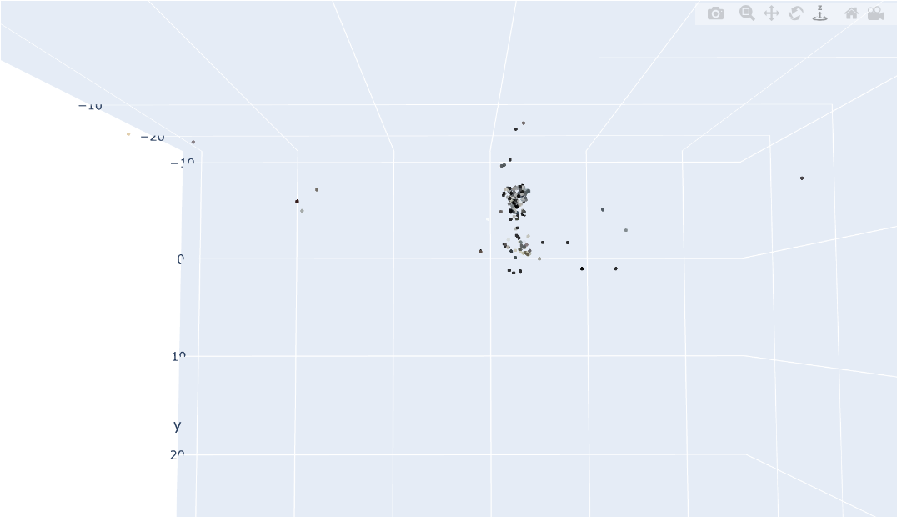

Our main goal is to reconstruct 3D object(in our case, church) from set of images.

In this version, we are going to recreate structure from motion by classic computer vision algorithms such as SIFT and BFMatching. Also we will use brute-force due to relatively small size of set of images. And for the record, in the next versions will be image comparison by similarity of embeddings, and usage of nerual networks for the keypoint detection and comparison.

If you want to see how model works, open the incremetal_sfm.ipynb 

## RESULT OF RECREATION

